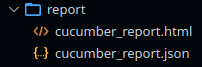
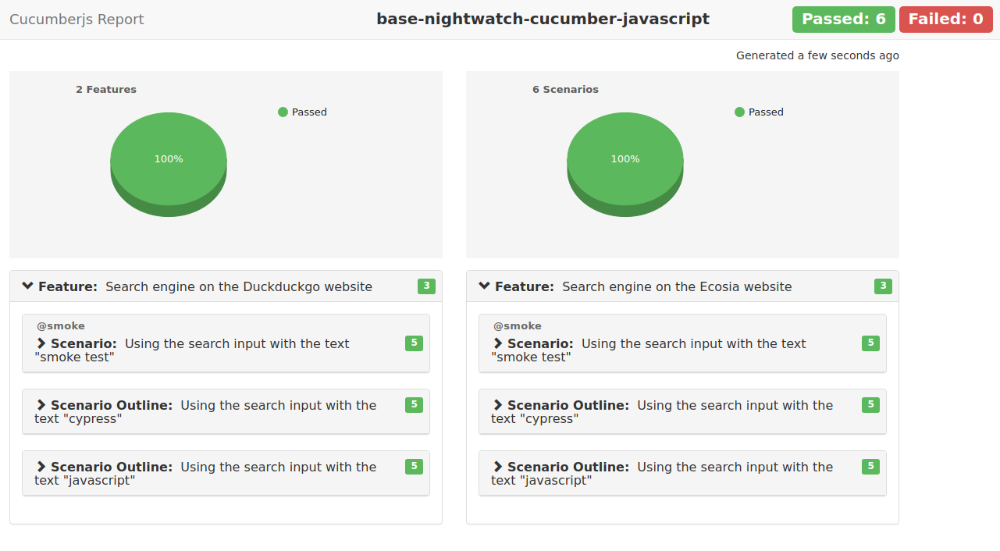

[](https://github.com/prettier/prettier)

# BDD base project: Nightwatch + Cucumber + Javascript

Basic example of using Nightwatch with Cucumber (BDD). This `Gherkin` example includes:
- Basic Scenario
- Scenario Outline
- Tagged tests

# Table of contents

* [Get started](#get-started)
  * [Installation](#installation)
* [How to run the tests](#how-to-run-the-tests)
  * [Running tests](#running-tests)
  * [Running tagged tests](#running-tagged-tests)
    * [Running tagged smoke tests](#running-tagged-smoke-tests)
    * [Running using customized tags](#running-using-customized-tags)
* [Static code analysis tools](#static-code-analysis-tools)
  * [ESLint](#eslint)
    * [Find Problems](#find-problems)
    * [Fix Automatically](#fix-automatically)
* [Issues](#issues)
* [License](#license)
* [Changelog](#changelog)

# Get started

## Installation

```bash
npm install
```

# How to run the tests

## Running tests

```bash
npm test
```

```bash
6 scenarios (6 passed)
30 steps (30 passed)
0m32.161s (executing steps: 0m27.856s)

generating report (2 features)...

🚀 Cucumber HTML report report/cucumber_report.html generated successfully 👍
```

- **`./report/ folder`**:

  

- **`HTML report`**:

  

## Running tagged tests

### Running tagged smoke tests

```bash
# defined in package.json file
npm run tag:smoke
```

### Running using customized tags

```bash
npm run test -- --tags '<EXPRESSION>'
```

*more details*: [running-tagged-tests](https://github.com/cucumber/cucumber-js/blob/main/docs/cli.md#tags)

# Static code analysis tools

## ESLint

### Find Problems

ESLint statically analyzes the code to find problems.

```bash
npm run lint
```

### Fix Automatically

Many problems ESLint finds can be automatically fixed.

```bash
npm run lint:fix
```

# Issues

*github*: [see full list](https://github.com/cucumber/cucumber-js/issues)

# License

[MIT](./LICENSE)

# Changelog

- 1.0.0 - Initial version.
